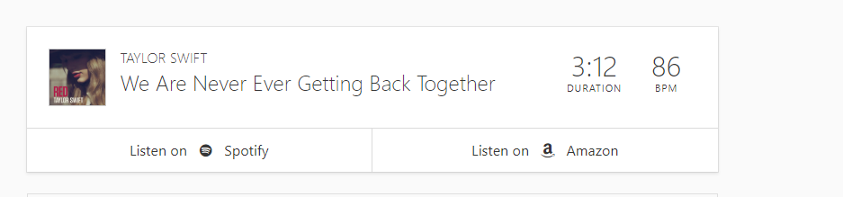

**Note**: Something I wanted to do but couldn't complete. If you want to work together on this, create an issue or contact me at kushashwaravishrimali@gmail.com. Thanks!

## Sample on Song: "We are never ever getting back together"

BPM of the song: 86, Source: https://songbpm.com/</img>

## Steps:

1. Find the BPM of the song. 
2. Make a video using that BPM.
3. Experiment, and change things

## TODO

1. Blurring - Done!
2. **Calculate Amplitude.**
3. **Zoom-in and Zoom-Out: Padding**
